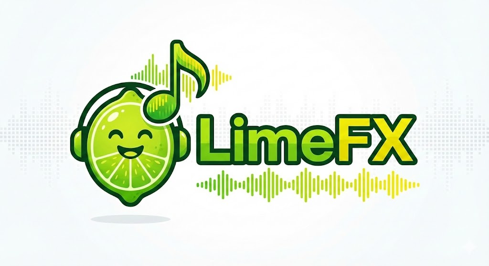
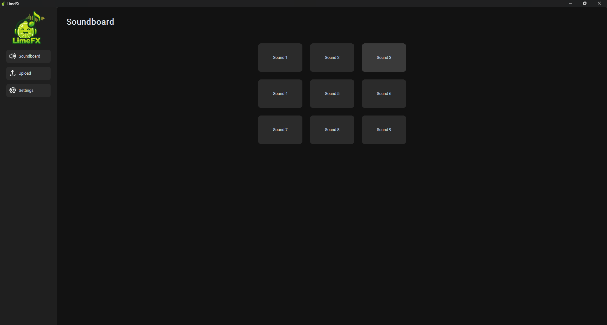
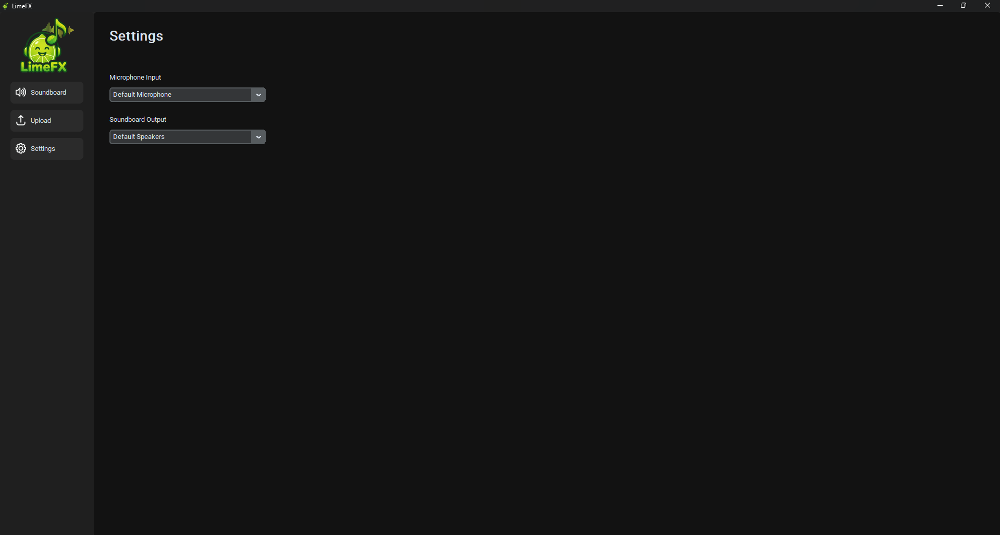

# LimeFX

<table align="center">
    <tr>
        <td>
            
        </td>
    </tr>
</table>

## Genel Bakış

**LimeFX**, sesli sohbetler ve yayınlar için tasarlanmış bir **soundboard** uygulamasıdır.  
Uygulama:

- **Python** ile yazılmış bir frontend
- **Rust** ile yazılmış bir backend

kullanarak hızlı, stabil ve kullanıcı dostu bir deneyim sunmayı hedefler.

## Özellikler

- 🎵 Tek tıkla ses oynatma
- 🎙️ Discord, oyun içi sesli sohbetler ve yayınlar için uygun
- ⚡ Düşük gecikme, yüksek performans
- 🎨 Modern ve sade arayüz

## Ekran Görüntüleri

| Soundboard | Ayarlar |
|------------|---------|
|  |  |

## Grafik Bileşenleri

İkonlar: [/assets](https://github.com/Kem0wow/LimeFX/tree/main/assets)

Kaynaklar: [[1]](https://www.flaticon.com/) [[2]](https://www.freepik.com/)

## Kurulum

> ⚠️ Proje hâlâ geliştirme aşamasındadır.

```bash
git clone https://github.com/Kem0wow/LimeFX.git
cd LimeFX
pip install -r requirements.txt
python ui/main.py
